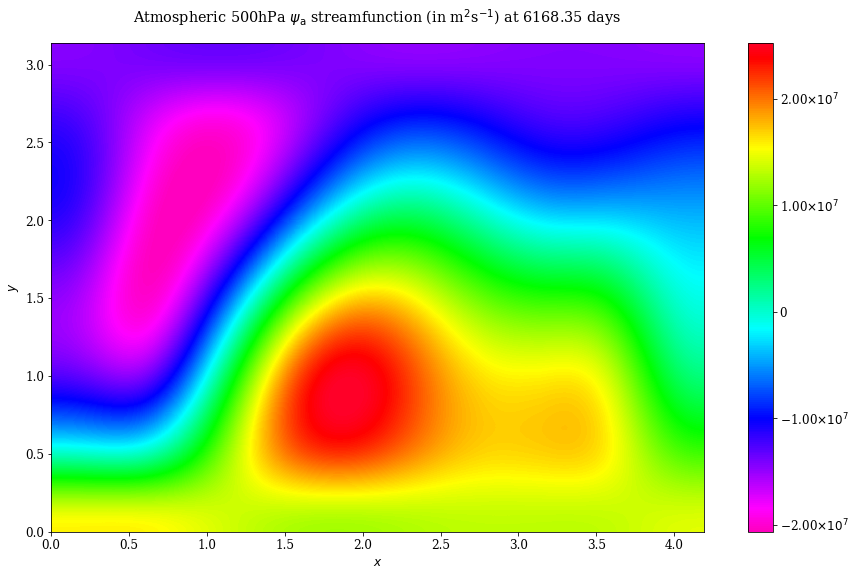
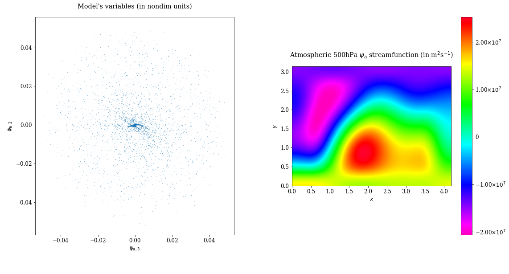

In addition to the plotting of the model’s variables (the coefficients
of the spectral expansion of the fields), it is also possible to plot
several diagnostics associated to these variables, whether they are
fields or scalars. These diagnostics are arranged in classes (:class:`.Diagnostic` being the parent abstract base class) and must be
instantiated to obtain objects that convert the model output to the
corresponding diagnostics.

For instance, we can define a :class:`.MiddleAtmosphericStreamfunctionDiagnostic` diagnostic that returns the
500hPa streamfunction field:

.. code:: ipython3

    psi_a = MiddleAtmosphericStreamfunctionDiagnostic(model_parameters)

and *feed* it with a model outputs ``time`` and ``trajectory`` previously computed
(like in the previous section):

.. code:: ipython3

    psi_a.set_data(time, trajectory)

It is then possible to plot the corresponding fields with the :meth:`~.FieldDiagnostic.plot` method:

.. code:: ipython3

    psi_a.plot(50)

or to easily create animation widget and movie of the diagnostic with
respectively the :meth:`~.FieldDiagnostic.animate` and :meth:`~.FieldDiagnostic.movie` methods:

.. code:: ipython3

    psi_a.movie(figsize=(13,8), anim_kwargs={'interval': 100, 'frames':100})

.. include:: user_guide/vid_diag.rst

All the diagnostics classes should in principle have these 3 methods
(``plot``, ``animate`` and ``movie``). Note that the movies can also be
saved in mpeg 4 format.

One can also define multiple diagnostics and couple them toghether with
a :class:`.MultiDiagnostic` object. For instance, here we couple the previous ``psi_a``
diagnostic with a dynamical scatter plot:

.. code:: ipython3

    variable_nondim = VariablesDiagnostic([2, 1, 0], model_parameters, False)
    m = MultiDiagnostic(1,2)
    m.add_diagnostic(variable_nondim, diagnostic_kwargs={'show_time':True, 'style':'2Dscatter'}, plot_kwargs={'ms': 0.2})
    m.add_diagnostic(psi_a, diagnostic_kwargs={'show_time':False})
    m.set_data(time, trajectory)

As with the other diagnostics, the :class:`.MultiDiagnostic` object can plot
and create movies:

.. code:: ipython3

    m.plot(50)

.. code:: ipython3

    m.movie(figsize=(15,8), anim_kwargs={'interval': 100, 'frames':100})

.. include:: user_guide/vid_multi.rst

Further examples using the diagnostics can be found in the sections :ref:`files/examples/RP:Recovering the result of Reinhold and Pierrehumbert (1982)`,
:ref:`files/examples/DDV:Recovering the result of De Cruz, Demaeyer and Vannitsem (2016)` and :ref:`files/examples/manual:Manual setting of the basis`.
Examples are also provided in the in the ``notebooks`` folder.

Moreover, the diagnostics classes methods are fully described in the section :ref:`files/technical/diagnostics:Diagnostics` of the
:ref:`files/references:References`.
