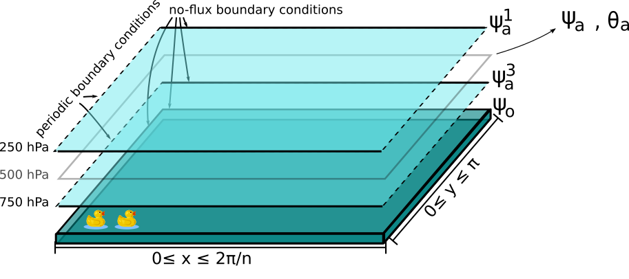

Coupled ocean-atmosphere model (MAOOAM)
=======================================

This model version is composed of a two-layer quasi-geostrophic :ref:`files/model/atmosphere:Atmospheric component`
coupled both thermally and mechanically to a shallow-water :ref:`files/model/ocean:Oceanic component`.
The coupling between the two components includes wind forcings, radiative and heat exchanges.

    Sketch of the ocean-atmosphere coupled model layers.
    The domain (:math:`\beta`-plane) `zonal and meridional`_ coordinates are labeled as the :math:`x` and
    :math:`y` variables.

The evolution equations for the atmospheric and oceanic streamfunctions defined in the sections above read

.. math::

    \frac{\partial}{\partial t}  \left(\nabla^2 \psi^1_{\rm a}\right)+ J(\psi^1_{\rm a}, \nabla^2 \psi^1_{\rm a})+ \beta \frac{\partial \psi^1_{\rm a}}{\partial x}
    & = -k'_d \nabla^2 (\psi^1_{\rm a}-\psi^3_{\rm a})+ \frac{f_0}{\Delta p} \omega \nonumber \\
    \frac{\partial}{\partial t} \left( \nabla^2 \psi^3_{\rm a} \right) + J(\psi^3_{\rm a}, \nabla^2 \psi^3_{\rm a}) + \beta \frac{\partial \psi^3_{\rm a}}{\partial x}
    & = +k'_d \nabla^2 (\psi^1_{\rm a}-\psi^3_{\rm a}) - \frac{f_0}{\Delta p}  \omega \nonumber - k_d \nabla^2 \left(\psi^3_{\rm a} - \psi_{\rm o}\right) \\
    \frac{\partial}{\partial t} \left( \nabla^2 \psi_\text{o} - \frac{\psi_\text{o}}{L_\text{R}^2} \right) + J(\psi_\text{o}, \nabla^2 \psi_\text{o}) + \beta \frac{\partial \psi_\text{o}}{\partial x}
    & = -r \nabla^2 \psi_\text{o} +\frac{C}{\rho_{\rm o} h} \nabla^2 (\psi^3_\text{a}-\psi_\text{o}).\nonumber

where :math:`\rho_{\rm o}` is the density of the ocean's water and :math:`h` is the depth of its layer (:attr:`~.params.OceanicParams.h`).
The rightmost term of the last equation represents the impact of the wind stress on the ocean, and is modulated
by the coefficient of the mechanical ocean-atmosphere coupling, :math:`d = C/(\rho_{\rm o} h)` (:attr:`~.params.OceanicParams.d`).

As we did for the :ref:`files/model/oro_model:Model with an orography and a temperature profile`, we rewrite these equations in terms of the `barotropic`_ streamfunction :math:`\psi_{\rm a}` and `baroclinic`_ streamfunction :math:`\theta_{\rm a}`:

.. math::

    &\frac{\partial}{\partial t}  \left(\nabla^2 \psi_{\rm a}\right) + J(\psi_{\rm a}, \nabla^2 \psi_{\rm a}) + J(\theta_{\rm a}, \nabla^2 \theta_{\rm a}) + \beta \frac{\partial \psi_{\rm a}}{\partial x} = - \frac{k_d}{2} \nabla^2 (\psi_{\rm a} - \theta_{\rm a} - \psi_{\rm o}) \\
    &\frac{\partial}{\partial t} \left( \nabla^2 \theta_{\rm a} \right) + J(\psi_{\rm a}, \nabla^2 \theta_{\rm a}) + J(\theta_{\rm a}, \nabla^2 \psi_{\rm a}) + \beta \frac{\partial \theta_{\rm a}}{\partial x} \nonumber \\
    & \qquad \qquad \qquad \qquad \qquad \qquad = - 2 \, k'_d \nabla^2 \theta_{\rm a} + \frac{k_d}{2} \nabla^2 (\psi_{\rm a} - \theta_{\rm a} - \psi_{\rm o}) + \frac{f_0}{\Delta p}  \omega \nonumber \\
    &\frac{\partial}{\partial t} \left( \nabla^2 \psi_\text{o} - \frac{\psi_\text{o}}{L_\text{R}^2} \right) + J(\psi_\text{o}, \nabla^2 \psi_\text{o}) + \beta \frac{\partial \psi_\text{o}}{\partial x} = -r \nabla^2 \psi_\text{o} + d \, \nabla^2 (\psi_\text{a}- \theta_\text{a}-\psi_\text{o}).\nonumber

Temperature equations
---------------------

The temperature :math:`T_\text{o}` in the ocean is a passively advected scalar interacting with the atmospheric temperature through radiative and heat exchange, according to a scheme detailed in :cite:`mao-BB1998`:

.. math::

    \gamma_\text{o} \left( \frac{\partial T_\text{o}}{\partial t} + J(\psi_\text{o}, T_\text{o}) \right) = -\lambda (T_\text{o}-T_\text{a}) -\sigma_\text{B} T_\text{o}^4 + \epsilon_\text{a} \sigma_\text{B} T_\text{a}^4 + R_\text{o}

and the time evolution of the atmospheric temperature :math:`T_\text{a}` obeys a similar equation:

.. math::

    \gamma_\text{a} \left( \frac{\partial T_\text{a}}{\partial t} + J(\psi_\text{a}, T_\text{a}) -\sigma \omega \frac{p}{R}\right) = -\lambda (T_\text{a}-T_\text{o}) + \epsilon_\text{a} \sigma_\text{B} T_\text{o}^4 - 2 \epsilon_\text{a} \sigma_\text{B} T_\text{a}^4 + R_\text{a}

where :math:`\gamma_\text{a}` (:attr:`.AtmosphericTemperatureParams.gamma`) and :math:`\gamma_\text{o}`
(:attr:`.OceanicTemperatureParams.gamma`) are the heat capacities of the
atmosphere and the active ocean layer. :math:`\lambda` (:attr:`~.AtmosphericTemperatureParams.hlambda`) is the heat transfer coefficient at the
ocean-atmosphere interface.
:math:`\sigma` (:attr:`~.params.AtmosphericParams.sigma`) is the static stability of the atmosphere, taken to be constant.
The quartic terms represent the long-wave
radiation fluxes between the ocean, the atmosphere, and outer space, with
:math:`\epsilon_\text{a}` (:attr:`~.AtmosphericTemperatureParams.eps`)  the emissivity of the grey-body atmosphere and
:math:`\sigma_\text{B}` (:attr:`~.QgParams.sb`) the Stefan--Boltzmann constant. By decomposing the
temperatures as :math:`T_\text{a} = T_{\text{a},0} + \delta T_\text{a}` and :math:`T_\text{o} = T_{\text{o},0} + \delta T_\text{o}`, the quartic terms are
linearized around spatially uniform and constant temperatures :math:`T_{\text{a},0}` (:attr:`.AtmosphericTemperatureParams.T0`) and
:math:`T_{\text{o},0}` (:attr:`.OceanicTemperatureParams.T0`), as detailed in Appendix B of :cite:`mao-VDDG2015`. :math:`R_\text{a}`
and :math:`R_\text{o}` are the short-wave radiation fluxes entering the atmosphere
and the ocean that are also decomposed as :math:`R_\text{a}=R_\text{a}^0 + \delta
R_\text{a}` and :math:`R_\text{o} = R_\text{o}^0 + \delta R_\text{o}`. It results in these evolution equations for the temperature anomalies:

.. math::

    \gamma_{\rm a} \Big( \frac{\partial \delta T_{\rm a}}{\partial t} + J(\psi_{\rm a}, \delta T_{\rm a} )- \sigma \omega \frac{\delta p}{R}\Big) &= -\lambda (\delta T_{\rm a}- \delta T_{\rm o}) +4 \sigma_B T_{{\rm o},0}^3 \delta T_{\rm o} - 8 \epsilon_{\rm a} \sigma_B T_{{\rm a},0}^3 \delta T_{\rm a} + \delta R_{\rm a} \nonumber \\
    \gamma_{\rm o} \Big( \frac{\partial \delta T_{\rm o}}{\partial t} + J(\psi_{\rm o}, \delta T_{\rm o})\Big) &= -\lambda (\delta T_{\rm o}- \delta T_{\rm a}) -4 \sigma_B T_{{\rm o},0}^3 \delta T_{\rm o} + 4 \epsilon_{\rm a} \sigma_B T_{{\rm a},0}^3 \delta T_{\rm a} + \delta R_{\rm o}. \nonumber

The hydrostatic relation in pressure coordinates is :math:`(\partial \Phi/\partial p)
= -1/\rho_\text{a}` with the geopotential height :math:`\Phi = f_0\;\psi_\text{a}` and :math:`\rho_\text{a}` the dry air density. The ideal gas relation :math:`p=\rho_\text{a} R T_\text{a}`
and the vertical discretization of the hydrostatic relation at 500 hPa allows to write the spatially dependent atmospheric temperature anomaly :math:`\delta T_\text{a} = 2f_0\;\theta_\text{a} /R` where :math:`R` (:attr:`~.QgParams.rr`) is
the ideal gas constant.

    Sketch of the energy balance of :cite:`mao-BB1998`. It underlies the radiative and heat exchange scheme in the model.

    Actual values of the energy flux between the ground and the atmosphere :cite:`mao-TFK2009`.

Set of basis functions
----------------------

The present model solves the equations above by projecting them onto a basis of functions, to obtain a
system of `ordinary differential equations`_ (ODE). This procedure is sometimes called a `Galerkin expansion`_.
This basis being finite, the resolution of the model is automatically truncated at the characteristic length of the
highest-resolution function of the basis.

The atmospheric set of basis functions :math:`F_i` is described in the section :ref:`files/model/oro_model:Projecting the equations on a set of basis functions`.

The oceanic set of basis functions
^^^^^^^^^^^^^^^^^^^^^^^^^^^^^^^^^^

Both oceanic fields :math:`\psi_{\rm o}` and :math:`\delta T_{\rm o}` are defined in a closed basin with no-flux boundary
conditions (:math:`\partial \cdot_{\rm o} /\partial x \equiv 0` at the meridional boundaries and
:math:`\partial \cdot_{\rm o}/\partial y \equiv 0` at the zonal boundaries).

These fields are projected on Fourier modes respecting these boundary conditions:

.. math::

    \phi_{H_{\rm o},P_{\rm o}} (x, y) = 2\sin(\frac{H_{\rm o} n}{2}x)\, \sin(P_{\rm o} y)

with integer values of :math:`H_{\rm o}`, :math:`P_{\rm o}`.
Again, :math:`x` and :math:`y` are the horizontal adimensionalized coordinates defined above.

To easily manipulate these functions and the coefficients of the fields
expansion, we number the basis functions along increasing values of :math:`H_{\rm o}` and then :math:`P_{\rm o}`.
It allows to write the set as :math:`\left\{ \phi_i(x,y); 1 \leq i \leq n_\text{o}\right\}` where :math:`n_{\mathrm{o}}`
(:attr:`~.params.QgParams.nmod` [1]) is the number of modes of the spectral expansion in the ocean.

For example, the model derived in :cite:`mao-VDDG2015` can be specified by setting :math:`H_{\rm o} \in \{1,4\}`; :math:`P_{\rm o} \in \{1,2\}` and the set of basis functions is

.. math::

    \phi_1(x,y) & = &  2\, \sin(\frac{n}{2} x)\, \sin(y), \nonumber \\
    \phi_2(x,y) & = &  2\, \sin(n x)\, \sin(y), \nonumber \\
    \phi_3(x,y) & = &  2\, \sin(\frac{3 n}{2} x)\, \sin(y), \nonumber \\
    \phi_4(x,y) & = &  2\, \sin(2 n x)\, \sin(y), \nonumber \\
    \phi_5(x,y) & = &  2\, \sin(\frac{n}{2} x)\, \sin(2 y), \nonumber \\
    \phi_6(x,y) & = &  2\, \sin(n x)\, \sin(2 y), \nonumber \\
    \phi_7(x,y) & = &  2\, \sin(\frac{3 n}{2} x)\, \sin(2 y), \nonumber \\
    \phi_8(x,y) & = &  2\, \sin(2 n x)\, \sin(2 y), \nonumber

such that

.. math::

    \nabla^2 \phi_i(x,y) = -m^2_i  \,\phi_i(x,y)

with eigenvalues :math:`m_i^2 = P_{{\rm o},i}^2 + n^2 \, H_{{\rm o},i}^2/4`.
These Fourier modes are also orthonormal with respect to the inner product

.. math::

    \frac{n}{2\pi^2}\int_0^\pi\int_0^{2\pi/n} \phi_i(x,y)\, \phi_j(x,y)\, \mathrm{d} x \, \mathrm{d} y = \delta_{ij}

where :math:`\delta_{ij}` is the `Kronecker delta`_. Note however that the atmospheric and oceanic basis :math:`F_i` and
:math:`\phi_i` are not orthonormal to each other.

    The first 8 basis functions :math:`\phi_i` evaluated on the nondimensional domain of the model.

Fields expansion
----------------

The fields of the model can expanded on these sets of basis functions according to

.. math::

     \psi_\text{a} (x,y) &= \sum_{i=1}^{n_\text{a}} \; \psi_{\text{a},i} \, F_i(x,y), \\
     \theta_\text{a}(x,y) &=\sum_{i=1}^{n_\text{a}} \theta_{\text{a},i} \; F_i(x,y), \\
     \delta T_\text{a}(x,y) &=\sum_{i=1}^{n_\text{a}} \delta T_{\text{a},i} \; F_i(x,y), \\
     &= 2 \frac{f_0}{R} \sum_{i=1}^{n_\text{a}} \theta_{\text{a},i} \; F_i(x,y), \nonumber\\
     \psi_\text{o}(x,y) &= \sum_{j=1}^{n_\text{o}} \psi_{\text{o},j} \; (\phi_j(x,y) \; -\; \overline{\phi_j}), \\
     \delta T_\text{o}(x,y) &= \sum_{j=1}^{n_\text{o}} \delta T_{\text{o},j} \; \phi_j(x,y).

In the expansion for :math:`\psi_\text{o}`, a term :math:`\overline{\phi_j}` is added to the oceanic
basis function :math:`\phi_j` in order to get a zero spatial
average. This is required to guarantee mass conservation in the ocean, but otherwise does not affect the dynamics. Indeed,
it can be added a posteriori when plotting the field
:math:`\psi_\text{o}`. This term is non-zero for odd :math:`P_\text{o}` and
:math:`H_\text{o}`:

.. math::
    \overline{\phi_j} &= \frac{n}{2\pi^2} \int _0^{\pi }\int _0^{\frac{2 \pi }{n}}\phi_j(x,y) \,\text{d}x \,\text{d}y  \\
                   &= 2\frac{((-1)^{H_\text{o}} - 1) ((-1)^{P_\text{o}} - 1)}{H_\text{o} P_\text{o} \pi^2}.\nonumber

The mass conservation is automatically satisfied for :math:`\psi_\text{a}`,
as the spatial averages of the atmospheric basis functions :math:`F_i` are zero.

Furthermore, the short-wave radiation or insolation is determined by

.. math::

    \delta R_\text{a}(x,y) = \sum_{i=1}^{n_\text{a}} \, C_{\text{a},i} \, F_i, \\
    \delta R_\text{o}(x,y) = \sum_{i=1}^{n_\text{a}} \, C_{\text{o},i} \, F_i.

which we project on the same atmospheric basis of function to maintain consistency and allow meridional gradients.
These decompositions are stored in the parameters :attr:`.AtmosphericTemperatureParams.C` and :attr:`.OceanicTemperatureParams.C` and
can be set using the functions :attr:`.AtmosphericTemperatureParams.set_insolation` and :attr:`.OceanicTemperatureParams.set_insolation`.

The vertical velocity :math:`\omega(x,y)` have also to be decomposed:

.. math::

    \omega(x,y) = \sum_{i=1}^{n_{\mathrm{a}}} \, \omega_i \, F_i(x,y) .

Ordinary differential equations
-------------------------------

The fields, parameters and variables are non-dimensionalized
by dividing time by :math:`f_0^{-1}` (:attr:`~.params.ScaleParams.f0`), distance by
the characteristic length scale :math:`L` (:attr:`~.params.ScaleParams.L`), pressure by the difference :math:`\Delta p` (:attr:`~.params.ScaleParams.deltap`),
temperature by :math:`f_0^2 L^2/R`, and streamfunction by :math:`L^2 f_0`. As a result of this non-dimensionalization, the
fields :math:`\theta_{\rm a}` and :math:`\delta T_{\rm a}` can be identified: :math:`2 \theta_{\rm a} \equiv \delta T_{\rm a}`.

The ordinary differential equations of the truncated model are:

.. math::

  \dot\psi_{{\rm a},i} & = & - a_{i,i}^{-1} \sum_{j,m = 1}^{n_{\mathrm{a}}} b_{i, j, m} \left(\psi_{{\rm a},j}\, \psi_{{\rm a},m} + \theta_{{\rm a},j}\, \theta_{{\rm a},m}\right) - \beta\, a_{i,i}^{-1} \, \sum_{j=1}^{n_{\mathrm{a}}} \, c_{i, j} \, \psi_{{\rm a},j} \nonumber \\
  & & \qquad \qquad \qquad \qquad - \frac{k_d}{2} \left(\psi_{{\rm a},i} - \theta_{{\rm a},i}\right) + \frac{k_d}{2} \, a_{i,i}^{-1} \, \sum_{j = 1}^{n_{\mathrm{o}}} d_{i,j} \, \psi_{{\rm o},j} \\
  \dot\theta_{{\rm a},i} & = & - a_{i,i}^{-1} \sum_{j,m = 1}^{n_{\mathrm{a}}} b_{i, j, m} \left(\psi_{{\rm a},j}\, \theta_{{\rm a},m} + \theta_{{\rm a},j}\, \psi_{{\rm a},m}\right) - \beta\, a_{i,i}^{-1} \, \sum_{j=1}^{n_{\mathrm{a}}} \, c_{i, j} \, \theta_{{\rm a},j}  \nonumber  \\
  & & \qquad \qquad \qquad \qquad + \frac{k_d}{2} \left(\psi_{{\rm a},i} - \theta_{{\rm a},i}\right) - \frac{k_d}{2}  \, a_{i,i}^{-1} \, \sum_{j = 1}^{n_{\mathrm{o}}} d_{i,j} \, \psi_{{\rm o},j} - 2 \, k'_d \, \theta_{{\rm a},i} + a_{i,i}^{-1} \, \omega_i \\
  \dot\theta_{\rm{a},i} & = & - \sum_{j,m = 1}^{n_{\mathrm{a}}} g_{i, j, m} \, \psi_{{\rm a},j}\, \theta_{{\rm a},m} +  \frac{\sigma}{2}\, \omega_i - \left(\lambda'_{\rm a} + S_{B,{\rm a}} \right)  \, \theta_{\rm{a},i} \nonumber \\
  & & \qquad \qquad \qquad \qquad  + \left(\frac{\lambda'_{\rm a}}{2}+ S_{B, {\rm o}}\right) \sum_{j=1}^{n_{\mathrm{o}}} \, s_{i, j} \, \delta T_{{\rm o},j} + C'_{\text{a},i} \\
  \dot\psi_{{\rm o},i} & = & \frac{1}{\left(M_{i,i} + G\right)} \, \left\{ - \sum_{j,m = 1}^{n_{\mathrm{o}}} \, C_{i,j,k} \, \psi_{{\rm o},j} \, \psi_{{\rm o},k} - \beta \, \sum_{j = 1}^{n_{\mathrm{o}}} \, N_{i,j} \, \psi_{{\rm o}, j} - (d + r) \, \sum_{j = 1}^{n_{\mathrm{o}}} \, M_{i,j} \, \psi_{{\rm o},j} \right. \nonumber \\
  & & \qquad \qquad \qquad \qquad + \left. d \, \sum_{j = 1}^{n_{\mathrm{a}}} \, K_{i,j} \, \left(\psi_{{\rm a}, j} - \theta_{{\rm a}, j}\right)\right\} \\
  \dot\delta T_{{\rm o},i} & = & - \sum_{j,m = 1}^{n_{\mathrm{o}}} \, O_{i,j,k} \, \psi_{{\rm o},j} \, \delta T_{{\rm o},k} - \left(\lambda'_{\rm o}+ s_{B,{\rm o}}\right) \, \delta T_{{\rm o},i} + \left(2 \,\lambda'_{\rm o} + s_{B,{\rm a}}\right) \, \sum_{j=1}^{n_{\mathrm{a}}} \, W_{i,j} \, \theta_{{\rm a},j} + \sum_{j=1}^{n_{\mathrm{a}}} \, W_{i,j} \, C'_{{\rm o},j}

where the parameters values have been replaced by their non-dimensional ones and we have also defined
:math:`G = - L^2/L_R^2` (:attr:`~.params.QgParams.G`),
:math:`\lambda'_{{\rm a}} = \lambda/(\gamma_{\rm a} f_0)` (:attr:`~.params.QgParams.Lpa`),
:math:`\lambda'_{{\rm o}} = \lambda/(\gamma_{\rm o} f_0)` (:attr:`~.params.QgParams.Lpgo`),
:math:`S_{B,{\rm a}} = 8\,\epsilon_{\rm a}\, \sigma_B \, T_{{\rm a},0}^3 / (\gamma_{\rm a} f_0)` (:attr:`~.params.QgParams.LSBpa`),
:math:`S_{B,{\rm o}} = 2\,\epsilon_{\rm a}\, \sigma_B \, T_{{\rm a},0}^3 / (\gamma_{\rm a} f_0)` (:attr:`~.params.QgParams.LSBpgo`),
:math:`s_{B,{\rm a}} = 8\,\epsilon_{\rm a}\, \sigma_B \, T_{{\rm a},0}^3 / (\gamma_{\rm o} f_0)` (:attr:`~.params.QgParams.sbpa`),
:math:`s_{B,{\rm o}} = 4\,\sigma_B \, T_{{\rm a},0}^3 / (\gamma_{\rm o} f_0)` (:attr:`~.params.QgParams.sbpgo`),
:math:`C'_{{\rm a},i} = R C_{{\rm a},i} / (2 \gamma_{\rm a} L^2 f_0^3)` (:attr:`~.params.QgParams.Cpa`),
:math:`C'_{{\rm o},i} = R C_{{\rm o},i} /   (\gamma_{\rm o} L^2 f_0^3)` (:attr:`~.params.QgParams.Cpgo`).

The coefficients :math:`a_{i,j}`, :math:`g_{i, j, m}`, :math:`b_{i, j, m}` and :math:`c_{i, j}` are the inner products of the Fourier modes :math:`F_i`:

.. math::

  a_{i,j} & = & \frac{n}{2\pi^2}\int_0^\pi\int_0^{2\pi/n} F_i(x,y)\, \nabla^2 F_j(x,y)\, \mathrm{d} x \, \mathrm{d} y = - \delta_{ij} \, a_i^2 \\
  g_{i, j, m} & = & \frac{n}{2\pi^2}\int_0^\pi\int_0^{2\pi/n} F_i(x,y)\, J\left(F_j(x,y), F_m(x,y)\right) \, \mathrm{d} x \, \mathrm{d} y \\
  b_{i, j, m} & = & \frac{n}{2\pi^2}\int_0^\pi\int_0^{2\pi/n} F_i(x,y)\, J\left(F_j(x,y), \nabla^2 F_m(x,y)\right) \, \mathrm{d} x \, \mathrm{d} y \\
  c_{i, j} & = & \frac{n}{2\pi^2}\int_0^\pi\int_0^{2\pi/n} F_i(x,y)\, \frac{\partial}{\partial x} F_j(x,y) \, \mathrm{d} x \, \mathrm{d} y

and the coefficients :math:`M_{i,j}`, :math:`O_{i, j, m}`, :math:`C_{i, j, m}` and :math:`N_{i, j}` are the inner products of the Fourier modes :math:`\phi_i`:

.. math::

  M_{i,j} & = & \frac{n}{2\pi^2}\int_0^\pi\int_0^{2\pi/n} \phi_i(x,y)\, \nabla^2 \phi_j(x,y)\, \mathrm{d} x \, \mathrm{d} y = - \delta_{ij} \, m_i^2 \\
  O_{i, j, m} & = & \frac{n}{2\pi^2}\int_0^\pi\int_0^{2\pi/n} \phi_i(x,y)\, J\left(\phi_j(x,y), \phi_m(x,y)\right) \, \mathrm{d} x \, \mathrm{d} y \\
  C_{i, j, m} & = & \frac{n}{2\pi^2}\int_0^\pi\int_0^{2\pi/n} \phi_i(x,y)\, J\left(\phi_j(x,y), \nabla^2 \phi_m(x,y)\right) \, \mathrm{d} x \, \mathrm{d} y \\
  N_{i, j} & = & \frac{n}{2\pi^2}\int_0^\pi\int_0^{2\pi/n} \phi_i(x,y)\, \frac{\partial}{\partial x} \phi_j(x,y) \, \mathrm{d} x \, \mathrm{d} y.

The coefficients involved in the ocean-atmosphere interactions :math:`W_{i,j}`, :math:`K_{i, j}`, :math:`d_{i, j}` and :math:`s_{i, j}` are the inner products between the Fourier modes :math:`\phi_i` and :math:`F_i`:

.. math::

  d_{i,j} & = & \frac{n}{2\pi^2}\int_0^\pi\int_0^{2\pi/n} F_i(x,y)\, \nabla^2 \phi_j(x,y)\, \mathrm{d} x \, \mathrm{d} y \\
  K_{i,j} & = & \frac{n}{2\pi^2}\int_0^\pi\int_0^{2\pi/n} \phi_i(x,y)\, \nabla^2 F_j(x,y)\, \mathrm{d} x \, \mathrm{d} y \\
  W_{i, j} & = & \frac{n}{2\pi^2}\int_0^\pi\int_0^{2\pi/n} \phi_i(x,y)\, F_j(x,y) \, \mathrm{d} x \, \mathrm{d} y = s_{j, i}

These inner products are computed according to formulas detailed in :cite:`mao-DDV2016` and stored in objects derived from the :class:`~.inner_products.base.AtmosphericInnerProducts` and
:class:`~.inner_products.base.OceanicInnerProducts` classes.

The vertical velocity :math:`\omega_i` can be eliminated, leading to the final equations

.. math::

  \dot\psi_{{\rm a},i} & = & - a_{i,i}^{-1} \sum_{j,m = 1}^{n_{\mathrm{a}}} b_{i, j, m} \left(\psi_{{\rm a},j}\, \psi_{{\rm a},m} + \theta_{{\rm a},j}\, \theta_{{\rm a},m}\right) - \beta\, a_{i,i}^{-1} \, \sum_{j=1}^{n_{\mathrm{a}}} \, c_{i, j} \, \psi_{{\rm a},j} \nonumber \\
  & & \qquad \qquad \qquad \qquad - \frac{k_d}{2} \left(\psi_{{\rm a},i} - \theta_{{\rm a},i}\right) + \frac{k_d}{2}  \, a_{i,i}^{-1} \, \sum_{j = 1}^{n_{\mathrm{o}}} d_{i,j} \, \psi_{{\rm o},j} \\
  \dot\theta_{{\rm a},i} & = & \frac{\sigma/2}{a_{i,i} \,\sigma/2  - 1}  \left\{ - \sum_{j,m = 1}^{n_{\mathrm{a}}} b_{i, j, m} \left(\psi_{{\rm a},j}\, \theta_{{\rm a},m} + \theta_{{\rm a},j}\, \psi_{{\rm a},m}\right) - \beta\, \, \sum_{j=1}^{n_{\mathrm{a}}} \, c_{i, j} \, \theta_{{\rm a},j} \right. \nonumber  \\
  & & \qquad \qquad \qquad \qquad + \left. \frac{k_d}{2} \, a_{i,i} \left(\psi_{{\rm a},i} - \theta_{{\rm a},i}\right)  - \frac{k_d}{2}  \, a_{i,i}^{-1} \, \sum_{j = 1}^{n_{\mathrm{o}}} d_{i,j} \, \psi_{{\rm o},j} -2 \, k'_d \, a_{i,i} \, \theta_{{\rm a},i} \right\} \nonumber \\
  & & + \frac{1}{a_{i,i} \,\sigma/2  - 1} \left\{ \sum_{j,m = 1}^{n_{\mathrm{a}}} g_{i, j, m} \, \psi_{{\rm a},j}\, \theta_{{\rm a},m}  + \left(\lambda'_{\rm a} + S_{B,{\rm a}} \right)  \, \theta_{\rm{a},i} \right. \nonumber \\
  & & \qquad \qquad \qquad \qquad - \left.\left(\frac{\lambda'_{\rm a}}{2}+ S_{B, {\rm o}}\right) \sum_{j=1}^{n_{\mathrm{o}}} \, s_{i, j} \, \delta T_{{\rm o},j} - C'_{\text{a},i} \right\} \\
  \dot\psi_{{\rm o},i} & = & \frac{1}{\left(M_{i,i} + G\right)} \, \left\{ - \sum_{j,m = 1}^{n_{\mathrm{o}}} \, C_{i,j,k} \, \psi_{{\rm o},j} \, \psi_{{\rm o},k} - \beta \, \sum_{j = 1}^{n_{\mathrm{o}}} \, N_{i,j} \, \psi_{{\rm o}, j} - (d + r) \, \sum_{j = 1}^{n_{\mathrm{o}}} \, M_{i,j} \, \psi_{{\rm o},j} \right. \nonumber \\
  & & \qquad \qquad \qquad \qquad + \left. d \, \sum_{j = 1}^{n_{\mathrm{a}}} \, K_{i,j} \, \left(\psi_{{\rm a}, j} - \theta_{{\rm a}, j}\right)\right\} \\
  \dot\delta T_{{\rm o},i} & = & - \sum_{j,m = 1}^{n_{\mathrm{o}}} \, O_{i,j,k} \, \psi_{{\rm o},j} \, \delta T_{{\rm o},k} - \left(\lambda'_{\rm o}+ s_{B,{\rm o}}\right) \, \delta T_{{\rm o},i} + \left(2 \,\lambda'_{\rm o} + s_{B,{\rm a}}\right) \, \sum_{j=1}^{n_{\mathrm{a}}} \, W_{i,j} \, \theta_{{\rm a},j}  + \sum_{j=1}^{n_{\mathrm{a}}} \, W_{i,j} \, C'_{{\rm o},j}

that are implemented by means of a tensorial contraction:

.. math::

    \frac{\text{d}\eta_i}{\text{d}t} = \sum_{j, k=0}^{2 (n_\mathrm{a}+n_\mathrm{o})} \mathcal{T}_{i,j,k} \; \eta_j \; \eta_k

with :math:`\boldsymbol{\eta} = (1, \psi_{{\rm a},1}, \ldots, \psi_{{\rm a},n_\mathrm{a}}, \theta_{{\rm a},1}, \ldots, \theta_{{\rm a},n_\mathrm{a}}, \psi_{{\rm o},1}, \ldots, \psi_{{\rm o},n_\mathrm{o}}, \delta T_{{\rm o},1}, \ldots, \delta T_{{\rm o},n_\mathrm{o}})`, as described in the :ref:`files/technical_description:Code Description`. Note that :math:`\eta_0 \equiv 1`.
The tensor :math:`\mathcal{T}`, which fully encodes the bilinear system of ODEs above, is computed and stored in the :class:`~.tensors.qgtensor.QgsTensor`.

.. TODO: section about MAOSOAM

Example
-------

An example about how to setup the model to use this model version is shown in :ref:`files/examples/DDV:Recovering the result of De Cruz, Demaeyer and Vannitsem (2016)`.

References
----------

.. bibliography:: ref.bib
    :keyprefix: mao-

.. _zonal and meridional: https://en.wikipedia.org/wiki/Zonal_and_meridional_flow
.. _Kronecker delta: https://en.wikipedia.org/wiki/Kronecker_delta
.. _ordinary differential equations: https://en.wikipedia.org/wiki/Ordinary_differential_equation
.. _Galerkin expansion: https://en.wikipedia.org/wiki/Galerkin_method
.. _baroclinic: https://en.wikipedia.org/wiki/Baroclinity
.. _barotropic: https://en.wikipedia.org/wiki/Barotropic_fluid
