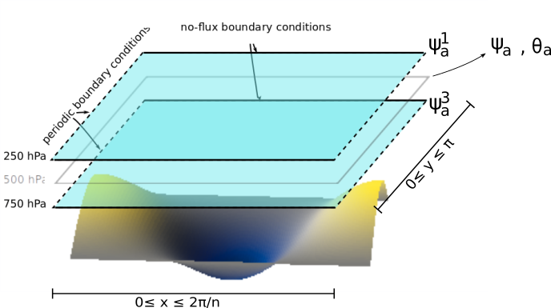

Model with an orography and a temperature profile
=================================================

An `orography`_ and a mean potential temperature profile can be added to the system.
The resulting model is described in detail in :cite:`om-CS1980` and :cite:`om-RP1982`.

Friction with the ground
------------------------

The atmosphere is coupled to the orography through mechanical coupling (friction).

    Sketch of the atmospheric model layers with a simple `orography`_.
    The domain (:math:`\beta`-plane) nondimensional `zonal and meridional`_ coordinates are labeled as the :math:`x` and
    :math:`y` variables.

It transforms the equations in :ref:`files/model/atmosphere:Atmospheric component` into

.. math::

    \frac{\partial}{\partial t}  \left(\nabla^2 \psi^1_{\rm a}\right)+ J(\psi^1_{\rm a}, \nabla^2 \psi^1_{\rm a})+ \beta \frac{\partial \psi^1_{\rm a}}{\partial x}
    & = -k'_d \nabla^2 (\psi^1_{\rm a}-\psi^3_{\rm a})+ \frac{f_0}{\Delta p} \omega \nonumber \\
    \frac{\partial}{\partial t} \left( \nabla^2 \psi^3_{\rm a} \right) + J(\psi^3_{\rm a}, \nabla^2 \psi^3_{\rm a}) + J(\psi^3_{\rm a}, f_0 \, h/H_{\rm a})  + \beta \frac{\partial \psi^3_{\rm a}}{\partial x}
    & = +k'_d \nabla^2 (\psi^1_{\rm a}-\psi^3_{\rm a}) - k_d \nabla^2 \psi^3_{\rm a} - \frac{f_0}{\Delta p}  \omega \nonumber \\

where :math:`H_{\rm a}` is the characteristic depth of each fluid layer and the parameter :math:`k_d` (:attr:`~.params.AtmosphericParams.kd`) quantifies the friction
between the atmosphere and the surface. :math:`h` is the topographic height field.

Mid-layer equations and the thermal wind relation
-------------------------------------------------

The equations governing the time evolution of the mean and shear streamfunctions :math:`\psi_{\rm a} = (\psi^1_{\rm a} + \psi^3_{\rm a})/2` and :math:`\theta_{\rm a} = (\psi^1_{\rm a} - \psi^3_{\rm a})/2` is given by

.. math::

    &\frac{\partial}{\partial t}  \left(\nabla^2 \psi_{\rm a}\right) + J(\psi_{\rm a}, \nabla^2 \psi_{\rm a}) + J(\theta_{\rm a}, \nabla^2 \theta_{\rm a}) + \frac{1}{2} J(\psi_{\rm a} - \theta_{\rm a}, f_0 \, h/H_{\rm a}) + \beta \frac{\partial \psi_{\rm a}}{\partial x} = - \frac{k_d}{2} \nabla^2 (\psi_{\rm a} - \theta_{\rm a}) \\
    &\frac{\partial}{\partial t} \left( \nabla^2 \theta_{\rm a} \right) + J(\psi_{\rm a}, \nabla^2 \theta_{\rm a}) + J(\theta_{\rm a}, \nabla^2 \psi_{\rm a}) - \frac{1}{2} J(\psi_{\rm a} - \theta_{\rm a}, f_0 \, h/H_{\rm a}) + \beta \frac{\partial \theta_{\rm a}}{\partial x} \nonumber \\
    & \qquad \qquad \qquad \qquad \qquad \qquad = - 2 \, k'_d \nabla^2 \theta_{\rm a} + \frac{k_d}{2} \nabla^2 (\psi_{\rm a} - \theta_{\rm a}) + \frac{f_0}{\Delta p}  \omega.

:math:`\psi_{\rm a}` and :math:`\theta_{\rm a}` are often referred to as the `barotropic`_ and `baroclinic`_ streamfunctions, respectively. 
On the other hand, the thermodynamic equation governing the mean `potential temperature`_ :math:`T_{\rm a} = (T^1_{\rm a} + T^3_{\rm a})/2`, where :math:`T^1_{\rm a}` and :math:`T^3_{\rm a}` are the mean potential temperature in respectively the upper and lower layer, is given by :cite:`om-V2006`

.. math::

    2 \, \frac{\partial}{\partial t} T_{\rm a} + J(\psi_{\rm a}, 2 T_{\rm a}) = - \frac{\sigma}{H_{\rm a}} \,\omega + 2 h_d \, (T^\ast - T_{\rm a})

where :math:`h_d` (:attr:`~.params.AtmosphericTemperatureParams.hd`) is the `Newtonian cooling`_ coefficient indicating the tendency to return to the equilibrium temperature profile :math:`T^\ast`.
:math:`\sigma` (:attr:`~.params.AtmosphericParams.sigma`) is the static stability of the atmosphere, taken to be constant.
The thermal wind relation

.. math::

    \nabla^2 T_{\rm a} = A \, \nabla^2 \theta_{\rm a}

where :math:`A` is a constant, relates the baroclinic streamfunction and the temperature fields.
Upon `nondimensionalization`_, both fields are identified with each other: :math:`\theta_{\rm a} \equiv T_{\rm a}` and
:math:`\theta^\star \equiv T^\star`, and the equations above fully describe the system.

The mean streamfunction :math:`\psi_{\rm a}` and temperature :math:`\theta_{\rm a}` can be considered to be the value of these fields at the 500 hPa level.

Projecting the equations on a set of basis functions
----------------------------------------------------

The present model solves the equations above by projecting them onto a set of basis functions, to obtain a
system of `ordinary differential equations`_ (ODE). This procedure is sometimes called a `Galerkin expansion`_.
This basis being finite, the resolution of the model is automatically truncated at the characteristic length of the
highest-resolution function of the basis.

Both fields are defined in a zonally periodic channel with no-flux boundary conditions in the meridional direction (:math:`\partial \cdot /\partial x \equiv 0` at the meridional boundaries).

The fields are projected on Fourier modes respecting these boundary conditions:

.. math::

    &F^A_{P} (x, y)   =  \sqrt{2}\, \cos(P y), \\
    &F^K_{M,P} (x, y) =  2\cos(M nx)\, \sin(P y), \\
    &F^L_{H,P} (x, y) = 2\sin(H nx)\, \sin(P y)

with integer values of :math:`M`, :math:`H`, :math:`P`.
:math:`x` and :math:`y` are the horizontal adimensionalized coordinates, rescaled
by dividing the dimensional coordinates by the characteristic length :math:`L` (:attr:`~.params.ScaleParams.L`).
The model's domain is then defined by :math:`(0 \leq x \leq \frac{2\pi}{n}, 0 \leq y \leq \pi)`, with :math:`n` (:attr:`~.params.ScaleParams.n`) the aspect ratio
between its meridional and zonal extents :math:`L_y` (:attr:`~.params.ScaleParams.L_y`) and :math:`L_x` (:attr:`~.params.ScaleParams.L_x`).

To easily manipulate these functions and the coefficients of the fields
expansion, we number the basis functions along increasing values of :math:`M= H` and then :math:`P`. It allows to
write the set as :math:`\left\{ F_i(x,y); 1 \leq i \leq n_\text{a}\right\}` where :math:`n_{\mathrm{a}}`
(:attr:`~.params.QgParams.nmod` [0]) is the number of modes of the spectral expansion.

For example, with :math:`M=H=1` and :math:`P \in \{1,2\}`, one obtains the spectral truncation used by :cite:`om-CS1980`.
The model derived in :cite:`om-RP1982` extended this set by two blocks of two functions each, and the
resulting set can be specified as :math:`M,H \in \{1,2\}`; :math:`P \in \{1,2\}`. The corresponding set of basis functions is

.. math::

    F_1(x,y) & = &  \sqrt{2}\, \cos(y), \nonumber \\
    F_2(x,y) & = &  2\, \cos(n x)\, \sin(y), \nonumber \\
    F_3(x,y) & = &  2\, \sin(n x)\, \sin(y), \nonumber \\
    F_4(x,y) & = &  \sqrt{2}\, \cos(2y), \nonumber \\
    F_5(x,y) & = &   2  \cos(n x) \sin(2y),  \nonumber \\
    F_6(x,y) & = &   2 \sin(n x) \sin(2y), \nonumber \\
    & \vdots & \nonumber

such that

.. math::

    \nabla^2 F_i(x,y) = -a^2_i F_i(x,y)

with eigenvalues :math:`a_i^2 = P_i^2 + n^2 \, M_i^2` or :math:`a_i^2 = P_i^2 + n^2 \, H_i^2`.
These Fourier modes are orthonormal with respect to the inner product

.. math::

    \frac{n}{2\pi^2}\int_0^\pi\int_0^{2\pi/n} F_i(x,y)\, F_j(x,y)\, \mathrm{d} x \, \mathrm{d} y = \delta_{ij}

where :math:`\delta_{ij}` is the `Kronecker delta`_.

    The first 10 basis functions :math:`F_i` evaluated on the nondimensional domain of the model.

The model's fields can be decomposed as follows:

.. math::

    \psi_{\rm a}(x,y) & = & \sum_{i=1}^{n_{\mathrm{a}}} \, \psi_{{\rm a},i} \, F_i(x,y) \\
    \theta_{\rm a}(x,y) & = & \sum_{i=1}^{n_{\mathrm{a}}} \, \theta_{{\rm a},i} \, F_i(x,y) .

The radiative equilibrium temperature field :math:`\theta^\star(x,y)`, the topographic height field :math:`h(x,y)` and
the vertical velocity :math:`\omega(x,y)` also have to be decomposed into the eigenfunctions of the Laplacian:

.. math::

    \theta^\star(x,y) & = & \sum_{i=1}^{n_{\mathrm{a}}} \, \theta^\star_i \, F_i(x,y) \\
    h(x,y) & = & \sum_{i=1}^{n_{\mathrm{a}}} \, h_i \, F_i(x,y) \\
    \omega(x,y) & = & \sum_{i=1}^{n_{\mathrm{a}}} \, \omega_i \, F_i(x,y) .

These fields can be specified in the model by setting the (non-dimensional) vectors :attr:`~.params.GroundParams.hk`
and :attr:`~.params.AtmosphericTemperatureParams.thetas`. Note that :math:`h` is scaled by the characteristic height :math:`H_{\rm a}` of each layer,
and :math:`\theta^\star` is scaled by :math:`A f_0^2 L^2` (see section below).

Ordinary differential equations
-------------------------------

The fields, parameters and variables are non-dimensionalized
by dividing time by :math:`f_0^{-1}` (:attr:`~.params.ScaleParams.f0`), distance by
the characteristic length scale :math:`L` (:attr:`~.params.ScaleParams.L`), pressure by the difference :math:`\Delta p` (:attr:`~.params.ScaleParams.deltap`),
temperature by :math:`A f_0^2 L^2`, and streamfunction by :math:`L^2 f_0`. As stated above, a result of this non-dimensionalization is that the
field :math:`\theta_{\rm a}` is identified with :math:`T_{\rm a}`: :math:`\theta_{\rm a} \equiv T_{\rm a}`.

The ordinary differential equations of the truncated model are:

.. math::

  \dot\psi_{{\rm a},i} & = & - a_{i,i}^{-1} \sum_{j,m = 1}^{n_{\mathrm{a}}} b_{i, j, m} \left(\psi_{{\rm a},j}\, \psi_{{\rm a},m} + \theta_{{\rm a},j}\, \theta_{{\rm a},m}\right) - \frac{a_{i,i}^{-1}}{2} \sum_{j,m = 1}^{n_{\mathrm{a}}} g_{i, j, m} \, h_m \left(\psi_{{\rm a},j}-\theta_{{\rm a},j}\right) \nonumber \\
  & & \qquad \qquad \qquad \qquad - \beta\, a_{i,i}^{-1} \, \sum_{j=1}^{n_{\mathrm{a}}} \, c_{i, j} \, \psi_{{\rm a},j} - \frac{k_d}{2} \left(\psi_{{\rm a},i} - \theta_{{\rm a},i}\right) \\
  \dot\theta_{\rm{a},i} & = & - a_{i,i}^{-1} \sum_{j,m = 1}^{n_{\mathrm{a}}} b_{i, j, m} \left(\psi_{{\rm a},j}\, \theta_{{\rm a},m} + \theta_{{\rm a},j}\, \psi_{{\rm a},m}\right) + \frac{a_{i,i}^{-1}}{2} \sum_{j,m = 1}^{n_{\mathrm{a}}} g_{i, j, m} \, h_m \left(\psi_{{\rm a},j}-\theta_{{\rm a},j}\right) \nonumber  \\
  & & \qquad \qquad \qquad \qquad - \beta\, a_{i,i}^{-1} \, \sum_{j=1}^{n_{\mathrm{a}}} \, c_{i, j} \, \theta_{{\rm a},j} + \frac{k_d}{2} \left(\psi_{{\rm a},i} - \theta_{{\rm a},i}\right) -2 \, k'_d \, \theta_{{\rm a},i} + a_{i,i}^{-1} \, \omega_i \\
  \dot\theta_{\rm{a},i} & = & - \sum_{j,m = 1}^{n_{\mathrm{a}}} g_{i, j, m} \, \psi_{{\rm a},j}\, \theta_{{\rm a},m} + \frac{\sigma}{2} \, \omega_i + h_d \, \left(\theta^\ast_i - \theta_{{\rm a},i}\right)

where the parameters values have been replaced by their non-dimensional ones.
The coefficients :math:`a_{i,j}`, :math:`g_{i, j, m}`, :math:`b_{i, j, m}` and :math:`c_{i, j}` are the inner products of the Fourier modes :math:`F_i`:

.. math::

  a_{i,j} & = & \frac{n}{2\pi^2}\int_0^\pi\int_0^{2\pi/n} F_i(x,y)\, \nabla^2 F_j(x,y)\, \mathrm{d} x \, \mathrm{d} y = - \delta_{ij} \, a_i^2 \\
  g_{i, j, m} & = & \frac{n}{2\pi^2}\int_0^\pi\int_0^{2\pi/n} F_i(x,y)\, J\left(F_j(x,y), F_m(x,y)\right) \, \mathrm{d} x \, \mathrm{d} y \\
  b_{i, j, m} & = & \frac{n}{2\pi^2}\int_0^\pi\int_0^{2\pi/n} F_i(x,y)\, J\left(F_j(x,y), \nabla^2 F_m(x,y)\right) \, \mathrm{d} x \, \mathrm{d} y \\
  c_{i, j} & = & \frac{n}{2\pi^2}\int_0^\pi\int_0^{2\pi/n} F_i(x,y)\, \frac{\partial}{\partial x} F_j(x,y) \, \mathrm{d} x \, \mathrm{d} y

These inner products are computed according to formulas found in :cite:`om-CT1987` and stored in an object derived from the :class:`~.inner_products.base.AtmosphericInnerProducts` class.

The vertical velocity :math:`\omega_i` can be eliminated, leading to the final equations

.. math::

  \dot\psi_{{\rm a},i} & = & - a_{i,i}^{-1} \sum_{j,m = 1}^{n_{\mathrm{a}}} b_{i, j, m} \left(\psi_{{\rm a},j}\, \psi_{{\rm a},m} + \theta_{{\rm a},j}\, \theta_{{\rm a},m}\right) - \frac{a_{i,i}^{-1}}{2} \sum_{j,m = 1}^{n_{\mathrm{a}}} g_{i, j, m} \, h_m \left(\psi_{{\rm a},j}-\theta_{{\rm a},j}\right) \nonumber \\
  & & \qquad \qquad \qquad \qquad - \beta\, a_{i,i}^{-1} \, \sum_{j=1}^{n_{\mathrm{a}}} \, c_{i, j} \, \psi_{{\rm a},j} - \frac{k_d}{2} \left(\psi_{{\rm a},i} - \theta_{{\rm a},i}\right) \\
  \dot\theta_{{\rm a},i} & = & \frac{\sigma/2}{a_{i,i} \,\sigma/2  - 1}  \left\{ - \sum_{j,m = 1}^{n_{\mathrm{a}}} b_{i, j, m} \left(\psi_{{\rm a},j}\, \theta_{{\rm a},m} + \theta_{{\rm a},j}\, \psi_{{\rm a},m}\right) + \frac{1}{2} \sum_{j,m = 1}^{n_{\mathrm{a}}} g_{i, j, m} \, h_m \left(\psi_{{\rm a},j}-\theta_{{\rm a},j}\right) \right. \nonumber  \\
  & & \quad - \left. \beta\, \, \sum_{j=1}^{n_{\mathrm{a}}} \, c_{i, j} \, \theta_{{\rm a},j} + \frac{k_d}{2} \, a_{i,i} \left(\psi_{{\rm a},i} - \theta_{{\rm a},i}\right) -2 \, k'_d \, a_{i,i} \, \theta_{{\rm a},i} \right\} \nonumber \\
  & & + \frac{1}{a_{i,i} \,\sigma/2  - 1} \left\{ \sum_{j,m = 1}^{n_{\mathrm{a}}} g_{i, j, m} \, \psi_{{\rm a},j}\, \theta_{{\rm a},m} - h_d \, \left(\theta^\ast_i - \theta_{{\rm a},i}\right)\right\}

that are implemented in with a tensorial contraction:

.. math::

    \frac{\text{d}\eta_{{\rm{a},i}}}{\text{d}t} = \sum_{j, k=0}^{2 n_\mathrm{a}} \mathcal{T}_{i,j,k} \; \eta_{{\rm a},j} \; \eta_{{\rm a},k}

with :math:`\boldsymbol{\eta_{\mathrm{a}}} = (\psi_{{\rm a},1}, \ldots, \psi_{{\rm a},n_\mathrm{a}}, \theta_{{\rm a},1}, \ldots, \theta_{{\rm a},n_\mathrm{a}})`, as described in the :ref:`files/technical_description:Code Description`.
The tensor :math:`\mathcal{T}` is computed and stored in the :class:`~.tensors.qgtensor.QgsTensor`.

Example
-------

An example about how to setup the model to use this model version is shown in :ref:`files/examples/RP:Recovering the result of Reinhold and Pierrehumbert (1982)`.

References
----------

.. bibliography:: ref.bib
    :keyprefix: om-

.. _quasi-geostrophic: https://en.wikipedia.org/wiki/Quasi-geostrophic_equations
.. _MAOOAM: https://github.com/Climdyn/MAOOAM
.. _beta-plane: https://en.wikipedia.org/wiki/Beta_plane
.. _orography: https://en.wikipedia.org/wiki/Orography
.. _zonal and meridional: https://en.wikipedia.org/wiki/Zonal_and_meridional_flow
.. _Newtonian cooling: https://en.wikipedia.org/wiki/Newton%27s_law_of_cooling
.. _ordinary differential equations: https://en.wikipedia.org/wiki/Ordinary_differential_equation
.. _Galerkin expansion: https://en.wikipedia.org/wiki/Galerkin_method
.. _Kronecker delta: https://en.wikipedia.org/wiki/Kronecker_delta
.. _baroclinic: https://en.wikipedia.org/wiki/Baroclinity
.. _barotropic: https://en.wikipedia.org/wiki/Barotropic_fluid
.. _potential temperature: https://en.wikipedia.org/wiki/Potential_temperature
.. _nondimensionalization: https://en.wikipedia.org/wiki/Nondimensionalization
