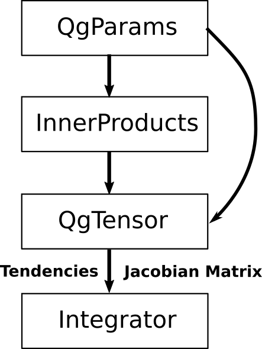

Code Description
================

Presently, the `ordinary differential equations`_ (ODEs) of the qgs model are at most bilinear
in their variables :math:`\eta_i` (:math:`1\leq i\leq` :attr:`~.params.QgParams.ndim`).
This system of ODEs can therefore be expressed as the sum of
a constant, a matrix multiplication, and a tensor contraction:

.. math::

    \frac{\mathrm{d}\eta_i}{\mathrm{d}t} = c_i + \sum_{j=1}^{\mathrm{ndim}} m_{i,j} \; \eta_j  + \sum_{j,k=1}^{\mathrm{ndim}} t_{i,j,k} \eta_j \eta_k

This expression can be further simplified by adding a dummy variable that is
identically equal to one: :math:`\eta_0\equiv 1`. This extra variable allows one to
merge :math:`c_i`, :math:`m_{i,j}`, and :math:`t_{i,j,k}` into the tensor
:math:`\mathcal{T}_{i,j,k}`, in which the linear terms are represented by
:math:`\mathcal{T}_{i,j,0}` and the constant term by :math:`\mathcal{T}_{i,0,0}`:

.. math::

    \frac{\text{d}\eta_i}{\text{d}t} = \sum_{j,k=0}^{\mathrm{ndim}} \mathcal{T}_{i,j,k} \, \eta_j \, \eta_k

The tensor :math:`\mathcal{T}` is computed and stored in the :class:`~.tensors.qgtensor.QgsTensor`.
Recasting the system of ordinary differential
equations for :math:`\eta_i` in the form of a tensor contraction has certain
advantages. Indeed, the symmetry of the tensor contraction allows for a unique representation
of :math:`\mathcal{T}_{i,j,k}`, if it is taken to be upper triangular in the last two
indices (:math:`\mathcal{T}_{i,j,k} \equiv 0` if :math:`j > k`). Since
:math:`\mathcal{T}_{i,j,k}` is known to be sparse, it is stored using the
coordinate list representation, i.e. a list of tuples
:math:`(i,j,k,\mathcal{T}_{i,j,k})` defined by the class :class:`sparse.COO`.
This representation renders the computation of the tendencies :math:`\text{d}\eta_i/\text{d}t` computationally very efficient as
well as conveniently parallelizable.

The form of the ODEs allows also to easily compute the
Jacobian matrix of the system. Indeed, denoting the right-hand side
of the equations as :math:`\text{d}\eta_i/\text{d}t = f_i`, the
expression reduces to

.. math::

    J_{i,j} = \frac{\text{d}f_i}{\text{d}\eta_j}& = \frac{\text{d}}{\text{d}\eta_j } (\sum_{k,l=0}^\mathrm{ndim} \mathcal{T}_{i,k,l} \; \eta_k \; \eta_l )  \\
             & = \sum_{k=0}^{\mathrm{ndim}} \left ( \mathcal{T}_{i,k,j} + \mathcal{T}_{i,j,k} \right) \eta_k

The differential form of the `tangent linear model`_ (TL) for a small
perturbation :math:`\boldsymbol{\delta\eta}^\text{TL}` of a trajectory
:math:`\boldsymbol{\eta}^{\ast}` is then simply :cite:`td-K2003`

.. math::

    \frac{\text{d}\delta\eta_i^\text{TL}}{\text{d}t} &= \sum_{j=1}^\mathrm{ndim} J^{\ast}_{i,j} \; \delta\eta_j^\text{TL}   \\
             &= \sum_{j=1}^\mathrm{ndim} \sum_{k=0}^\mathrm{ndim} \left ( \mathcal{T}_{i,k,j} + \mathcal{T}_{i,j,k} \right) \eta^{\ast}_k \; \delta\eta_j^\text{TL}

Computational flow
------------------

The computational flow is as follows:

1. The parameters are specified by instantiating a :class:`~.params.QgParams` .
2. The inner products are computed and stored in :class:`~.inner_products.base.AtmosphericInnerProducts` and :class:`~.inner_products.base.OceanicInnerProducts` objects.
3. The tensor of the tendencies terms are computed in a :class:`~.tensors.qgtensor.QgsTensor` object.
4. The functions :obj:`~.functions.tendencies.create_tendencies` create Numba optimized functions that return the tendencies and the Jacobian matrix.
5. These functions are passed to the numerical integrator in the module :mod:`~.integrators.integrator` .

    Sketch of the computational flow.

Additional technical information
--------------------------------

* qgs is optimized to run ensembles of initial conditions on multiple cores, using `Numba`_ jit-compilation and
  `multiprocessing`_ workers.

* qgs has a `tangent linear model`_ optimized to run ensembles of initial conditions as well, with a broadcast
  integration of the tangent model thanks to `Numpy`_.

References
----------

.. bibliography:: model/ref.bib
    :keyprefix: td-

.. _Numba: https://numba.pydata.org/
.. _Numpy: https://numpy.org/
.. _multiprocessing: https://docs.python.org/3.7/library/multiprocessing.html#module-multiprocessing
.. _tangent linear model: http://glossary.ametsoc.org/wiki/Tangent_linear_model
.. _ordinary differential equations: https://en.wikipedia.org/wiki/Ordinary_differential_equation
