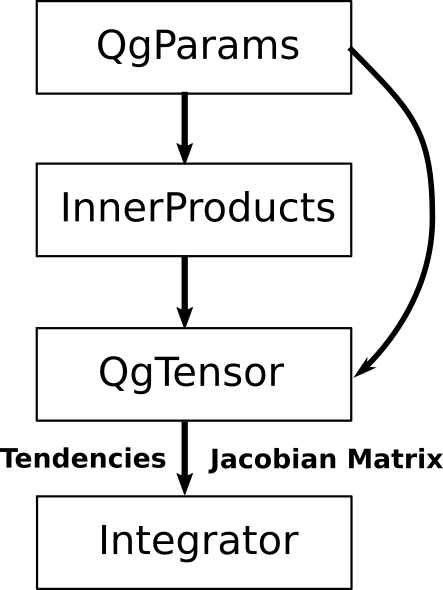

User guide
==========

This guide explains how the qgs framework can be used and configured to obtain the various model version.

1. Rationale behind qgs
------------------------

The purpose of qgs is to provide a Python callable representing the model's tendencies to the user, e.g. to provide
a function :math:`\boldsymbol{f}` (and also its Jacobian matrix) that can be integrated over time:

.. math:: \dot{\boldsymbol{x}} = \boldsymbol{f}(t, \boldsymbol{x})

to obtain the model's trajectory. This callable can of course also be used to perform any other kind of model analysis.

This guide provides:

1. The different ways to configure qgs in order to obtain the function :math:`\boldsymbol{f}` are explained in the section :ref:`files/user_guide:2. Configuration of qgs`.
2. Some specific ways to configure qgs detailed in the section :ref:`files/user_guide:3. Using user-defined symbolic basis`.
3. Examples of usages of the model's tendencies function :math:`\boldsymbol{f}` are given in the section :ref:`files/user_guide:4. Using qgs (once configured)`.

2. Configuration of qgs
-----------------------

The computational flow to compute the function :math:`\boldsymbol{f}` of the model's tendencies
:math:`\dot{\boldsymbol{x}} = \boldsymbol{f}(t, \boldsymbol{x})` is explained in
:ref:`files/technical_description:Computational flow` and sketched below:

    Sketch of the computational flow.

This flow can be implemented step by step by the user, or can be automatically performed by the functions :meth:`~qgs.functions.tendencies.create_tendencies`.
This function takes a :class:`~.params.QgParams` parameters object and return the function :math:`\boldsymbol{f}` and its Jacobian matrix.
Optionally, it can also return the byproducts of the tendencies generation process, i.e. the objects containing the inner products
between the model's spatial modes and the tensors of the model's tendencies terms.

This section of the user guide explains how to configure the :class:`~.params.QgParams` object to obtain the desired model version and
model's parameters.

2.1 Two different computational methods and three different geophysical components
^^^^^^^^^^^^^^^^^^^^^^^^^^^^^^^^^^^^^^^^^^^^^^^^^^^^^^^^^^^^^^^^^^^^^^^^^^^^^^^^^^^

Two different methods are available to configure qgs, related to two different methods of computing the inner products between its spatial `basis functions`_:

1. **Symbolic:** It is the main way to specify the `basis`_. The user can specify an arbitrary basis of functions on which the model's partial differential equations will be projected. Depending on the dimension of the model version and on the computing power available, it might take a while to initialize.
2. **Analytic:** The old method to specify the model version, in which the basis of functions are composed only of `Fourier modes`_ described in :ref:`files/model/maooam_model:Coupled ocean-atmosphere model (MAOOAM)` and is thus limited in term of modelling capacity. It is nevertheless the fastest way since it relies on analytic formulas derived in :cite:`user-DDV2016` to compute the basis functions.

There are also three different geophysical components presently available in qgs:

1. **Atmosphere:** This component is mandatory and provides a two-layers `quasi-geostrophic`_ atmosphere. See :ref:`files/model/atmosphere:Atmospheric component` for more details.
2. **Ocean:** This component provides a `shallow-water`_ active oceanic layer. See :ref:`files/model/ocean:Oceanic component` for more details.
3. **Ground:** This component provides a simple model for the ground (orography + heat exchange). It is present by default if only the atmospheric component is defined, but then with only the orography being activated (no heat exchange).

The components needed by the user and their parameters have to be defined by instantiating a :class:`~.params.QgParams` object.
How to create this object, initialize these components and set the parameters of the model is the subject of the next sections.

2.2 Initializing qgs
^^^^^^^^^^^^^^^^^^^^

The model initialization first step requires the creation of a :class:`~.params.QgParams` object:

.. code:: ipython3

    from qgs.params.params import QgParams
    model_parameters = QgParams()

This object contains basically all the information needed by qgs to construct the inner products and the tendencies tensor of the model, which are in turn needed to produces finally the model's function :math:`\boldsymbol{f}`.

The different components required by the user need then to be specified, by providing information about the basis of functions used to project
the partial differential equations of qgs. As said before, two methods are available:

2.2.1 The symbolic method
""""""""""""""""""""""""""

With this method, the user has to provide directly the basis of functions of each component. These functions have to be symbolic function expressions, and should be provided using `Sympy`_.
This has to be done using a :class:`~.basis.base.SymbolicBasis` object, which is basically a list of Sympy functions.

The user can construct his own basis (see below) or use the various built-in Fourier basis provided with qgs: :class:`~.basis.fourier.ChannelFourierBasis` or :class:`~.basis.fourier.BasinFourierBasis`.
In the latter case, convenient constructor functions have been defined to help the user get the Fourier basis: :meth:`~qgs.basis.fourier.contiguous_basin_basis` and :meth:`~qgs.basis.fourier.contiguous_channel_basis`.
These functions create `contiguous` Fourier basis for two different kind of boundary conditions (a zonal channel or a closed basin) shown on the first figure in :ref:`files/model/maooam_model:Coupled ocean-atmosphere model (MAOOAM)`.

.. note::

    A `contiguous` Fourier basis means here that the Fourier modes are all present in the model up to a given maximum wavenumber in each direction (`zonal and meridional`_).
    Hence one has only to specify the maximum wavenumbers (and the model's domain aspect ratio) to these constructor functions. One can also create non-`contiguous` Fourier basis by specifying wavenumbers explicitly at
    the :class:`~.basis.fourier.ChannelFourierBasis` or :class:`~.basis.fourier.BasinFourierBasis` instantiation (see the section :ref:`files/user_guide:3.1 A simple example` for an example).

Once constructed, the basis has to be provided to the :class:`~.params.QgParams` object by using dedicated methods: :meth:`~.params.QgParams.set_atmospheric_modes`, :meth:`~.params.QgParams.set_oceanic_modes` and :meth:`~.params.QgParams.set_ground_modes`.
With the constructor functions, one can activate the mandatory atmospheric layer by typing

.. code:: ipython3

    from qgs.basis.fourier import contiguous_channel_basis
    basis = contiguous_channel_basis(2, 2, 1.5)
    model_parameters.set_atmospheric_modes(basis)

where we have defined a channel Fourier basis up to wavenumber 2 in both directions and an aspect ratio of :math:`1.5`.

.. note::

    Please note that the aspect ratio of the basis object provided to qgs is not very important, because it is superseded by the aspect ratio sets in the :class:`~.params.QgParams` object.

To activate the ocean or the ground components, the user has simply to use the method :meth:`~.params.QgParams.set_oceanic_modes` and :meth:`~.params.QgParams.set_ground_modes`.
Note that providing a oceanic basis of functions automatically deactivate the ground component, and vice-versa.

Finally, since the `MAOOAM`_ Fourier basis are used frequently in qgs, convenient methods of the :class:`~.params.QgParams` object allow one to create easily these basis inside this object
(without the need to create them externally and then pass them to the qgs parameters object). These are the methods :meth:`~.params.QgParams.set_atmospheric_channel_fourier_modes`, :meth:`~.params.QgParams.set_oceanic_basin_fourier_modes` and :meth:`~.params.QgParams.set_ground_channel_fourier_modes`.
For instance, the effect obtained with the 3 previous lines of code (activating the atmosphere) can also be obtained by typing:

.. code:: ipython3

    model_parameters.set_atmospheric_channel_fourier_modes(2, 2, mode='symbolic')

These convenient methods can also initialize qgs with another method (called `analytic`) and which is described in the next section.

.. warning::

    If you initialize one component with the symbolic method, all the other component that you define must be initialized with the same method.

2.2.2 The analytic method
""""""""""""""""""""""""""

Computing the inner products of the symbolic functions defined with `Sympy`_ **can be very resources consuming**, therefore if the basis
of functions that you intend to use are the ones described in :ref:`files/model/maooam_model:Coupled ocean-atmosphere model (MAOOAM)`, you might be interested to use
the analytic method, which uses the analytic formula for the inner products given in :cite:`user-DDV2016`. This initialization mode is put in action by using the
convenient methods of the :class:`~.params.QgParams` object: :meth:`~.params.QgParams.set_atmospheric_channel_fourier_modes`, :meth:`~.params.QgParams.set_oceanic_basin_fourier_modes` and :meth:`~.params.QgParams.set_ground_channel_fourier_modes`.

For instance, to initialize a channel atmosphere with up to wavenumber 2 in both directions, one can simply write:

.. code:: ipython3

    model_parameters.set_atmospheric_channel_fourier_modes(2, 2, mode='analytic')

Note that it is the default mode, so removing the `mode` argument will result in the same behavior.

.. warning::

    If you initialize one component with the analytic method, all the other component that you define must be initialized with the same method.

2.3 Changing the default parameters of qgs
^^^^^^^^^^^^^^^^^^^^^^^^^^^^^^^^^^^^^^^^^^^^

Now, how to change the parameters of qgs? As stated in the :ref:`files/technical/configuration:The model's parameters module` section of the :ref:`files/references:References`,
there are seven types of parameters arranged in classes:

* :class:`~.params.ScaleParams` contains the model scale parameters.
* :class:`~.params.AtmosphericParams` contains the atmospheric dynamical parameters.
* :class:`~.params.AtmosphericTemperatureParams` containing the atmosphere's temperature and heat-exchange parameters.
* :class:`~.params.OceanicParams` contains the oceanic dynamical parameters.
* :class:`~.params.OceanicTemperatureParams` contains the ocean's temperature and heat-exchange parameters.
* :class:`~.params.GroundParams` contains the ground dynamical parameters (e.g. orography).
* :class:`~.params.GroundTemperatureParams` contains the ground's temperature and heat-exchange parameters.

These parameters classes are regrouped into the global structure :class:`~.params.QgParams` and are accessible through the attributes:

* :attr:`~.params.QgParams.scale_params` for :class:`~.params.ScaleParams`.
* :attr:`~.params.QgParams.atmospheric_params` for :class:`~.params.AtmosphericParams`.
* :attr:`~.params.QgParams.atemperature_params` for :class:`~.params.AtmosphericTemperatureParams`.
* :attr:`~.params.QgParams.oceanic_params` for :class:`~.params.OceanicParams`.
* :attr:`~.params.QgParams.gotemperature_params` for :class:`~.params.OceanicTemperatureParams`.
* :attr:`~.params.QgParams.ground_params` for :class:`~.params.GroundParams`.
* :attr:`~.params.QgParams.gotemperature_params` for :class:`~.params.GroundTemperatureParams`.

The parameters inside these structures can be changed by passing a dictionary of the new values to the :meth:`~.params.QgParams.set_params` method. For example, if one wants to change the
Coriolis parameter :math:`f_0` and the static stability of the atmosphere :math:`\sigma`, one has to write:

.. code:: ipython3

    model_parameters.set_params({'f0': 1.195e-4, 'sigma':0.14916})

where :obj:`model_parameters` is an instance of the :class:`~.params.QgParams` class. This method will find where the parameters are stored and will perform the
substitution. However, some parameters may not have a unique name, for instance there is a parameter :attr:`T0` for the stationary solution :math:`T_0` of the 0-th order temperature for both the
atmosphere and the ocean. In this case, one need to find out which part of the structure the parameter belongs to, and then call the :meth:`set_params` of the corresponding object.
For example, changing the parameter :attr:`~.params.AtmosphericTemperatureParams.T0` in the atmosphere can be done with:

.. code:: ipython3

    model_parameters.atemperature_params.set_params({'T0': 280.})

Finally, some specific methods allow to setup expansion [#expansion]_ coefficients.
Presently these are the  :attr:`.AtmosphericTemperatureParams.set_thetas`, :attr:`.AtmosphericTemperatureParams.set_insolation`,
:attr:`.OceanicTemperatureParams.set_insolation`, :attr:`.GroundTemperatureParams.set_insolation`
and :attr:`.GroundParams.set_orography` methods. For example, to activate the Newtonian cooling, one has to write:

.. code:: ipython3

    model_parameters.atemperature_params.set_thetas(0.1, 0)

which indicates that the first component [#component]_ of the radiative equilibrium mean temperature should be equal to :math:`0.1`.

.. note::

    Using both the atmospheric Newtonian cooling coefficients with :attr:`.AtmosphericTemperatureParams.set_thetas` and the heat exchange scheme :attr:`.AtmosphericTemperatureParams.set_insolation`
    together doesn't make so much sense. Using the Newtonian cooling scheme is useful when one wants to use the atmospheric model alone, while using the heat exchange scheme is useful when the atmosphere is
    connected to another component lying beneath it (ocean or ground).

Similarly, one activates the orography by typing:

.. code:: ipython3

    model_parameters.ground_params.set_orography(0.2, 1)

We refer the reader to the description of these methods for more details (just click on the link above to get there).

Once your model is configured, you can review the list of parameters by calling the method :meth:`.QgParams.print_params`:

.. code:: ipython3

    model_parameters.print_params()

2.4 Creating the tendencies function
^^^^^^^^^^^^^^^^^^^^^^^^^^^^^^^^^^^^^^

Once you have configured your :class:`.QgParams` instance, it is very simple to obtain the model's tendencies :math:`\boldsymbol{f}` and the its
Jacobian matrix :math:`\boldsymbol{\mathrm{Df}}`. Just pass it to the function :func:`.create_tendencies`:

.. code:: ipython3

    from qgs.functions.tendencies import create_tendencies

    f, Df = create_tendencies(model_parameters)

The function :meth:`f` hence produced can be used to generate the model's trajectories.
See the section :ref:`files/user_guide:4. Using qgs (once configured)` for the possible usages.

2.5 Saving your model
^^^^^^^^^^^^^^^^^^^^^^^

The simplest way to save your model is to `pickle`_ the functions generating the model's tendencies and the Jacobian matrix.
Hence, using the same name as in the previous section, one can type:

.. code:: ipython3

    import pickle

    # saving the model
    model={'f': f, 'Df': Df, 'parameters': model_parameters}

    with open('model.pickle', "wb") as file:
        pickle.dump(model, file, pickle.HIGHEST_PROTOCOL)

and it can be loaded again by typing

.. code:: ipython3

    from qgs.params.params import QgParams

    # loading the model
    with open('model.pickle', "rb") as file:
        model = pickle.load(file)

    f = model['f']
    model_parameters = model['parameters']

.. warning::

    Due to several different possible reasons, loading models saved previously on another machine may not work.
    The only thing to do is then to recompute the model tendencies with the loaded model parameters (using the function
    :func:`.create_tendencies`. In this case, it is better to save only the model parameters:

    .. code:: ipython3

        import pickle

        # saving the model

        with open('model_parameters.pickle', "wb") as file:
            pickle.dump(model_parameters, file, pickle.HIGHEST_PROTOCOL)

It is also possible to save the inner products and/or the tensor storing the terms of the model's tendencies. For instance, the function
:func:`.create_tendencies` allows to obtain these information:

.. code:: ipython3

    f, Df, inner_products, tensor = create_tendencies(model_parameters, return_inner_products=True, return_qgtensor=True)

The objects :class:`.QgParams`, the inner products, and the object :class:`.QgsTensor` hence obtained can be saved using `pickle`_ or the built-in
:meth:`save_to_file` methods (respectively :meth:`.QgParams.save_to_file`, :meth:`.AtmosphericInnerProducts.save_to_file` and :meth:`.QgsTensor.save_to_file`).

Using these objects, it is possible to reconstruct by hand the model's tendencies (see the section :ref:`files/user_guide:3.2 A more involved example: Manually setting the basis and the inner products definition` for an example).

3. Using user-defined symbolic basis
--------------------------------------

3.1 A simple example
^^^^^^^^^^^^^^^^^^^^^

In this simple example, we are going to create an atmosphere-ocean coupled model as in :cite:`user-VDDG2015`, but with some atmospheric modes missing.

First, we create the parameters object:

.. code:: ipython3

    from qgs.params.params import QgParams
    model_parameters = QgParams({'n': 1.5})

and we create a :class:`.ChannelFourierBasis` with all the modes up to wavenumber 2 in both directions, except the one with wavenumbers 1 and 2 in respectively the :math:`x` and :math:`y` direction:

.. code:: ipython3

    from qgs.basis.fourier import ChannelFourierBasis
    atm_basis = ChannelFourierBasis(np.array([[1,1],
                                              [2,1],
                                              [2,2]]),1.5)
    model_parameters.set_atmospheric_modes(atm_basis)

Finally, we add the same ocean version as in :cite:`user-VDDG2015`:

.. code:: ipython3

    model_parameters.set_oceanic_basin_fourier_modes(2,4,mode='symbolic')

The last step is to set the parameters according to your needs (as seen in the section :ref:`files/user_guide:2.3 Changing the default parameters of qgs`).

The model hence configured can be passed to the function creating the model's tendencies :math:`\boldsymbol{f}`, as detailed in the section :ref:`files/user_guide:2.4 Creating the tendencies function`.

3.2 A more involved example: Manually setting the basis and the inner products definition
^^^^^^^^^^^^^^^^^^^^^^^^^^^^^^^^^^^^^^^^^^^^^^^^^^^^^^^^^^^^^^^^^^^^^^^^^^^^^^^^^^^^^^^^^^^

.. warning::

    This initialization method is not yet well-defined in qgs. It builds the model block by block to construct an ad-hoc model version.

In this section, we describe how to setup a user-defined basis for one of the model's component. We will do it for the ocean, but
the approach is similar for the other components. We will project the ocean equations on four modes proposed in :cite:`user-P2011`:

.. math::

    \tilde\phi_1(x,y) & = &  2\, e^{-\alpha x} \, \sin(\frac{n}{2} x)\, \sin(y), \nonumber \\
    \tilde\phi_2(x,y) & = &  2\, e^{-\alpha x} \, \sin(n x)\, \sin(y), \nonumber \\
    \tilde\phi_3(x,y) & = &  2\, e^{-\alpha x} \, \sin(\frac{n}{2} x)\, \sin(2 y), \nonumber \\
    \tilde\phi_4(x,y) & = &  2\, e^{-\alpha x} \, \sin(n x)\, \sin(2 y), \nonumber \\

and connect it to the channel atmosphere defined in the sections above, using a symbolic basis of functions.
First we create the parameters object and the atmosphere:

.. code:: ipython3

    from qgs.params.params import QgParams
    model_parameters = QgParams({'n': 1.5})
    model_parameters.set_atmospheric_channel_fourier_modes(2, 2, mode="symbolic")

Then we create a :class:`.SymbolicBasis` object:

.. code:: ipython3

    from qgs.basis.base import SymbolicBasis
    ocean_basis = SymbolicBasis()

We must then specify the function of the basis using `Sympy`_:

.. code:: ipython3

    from sympy import symbols, sin, exp
    x, y = symbols('x y')  # x and y coordinates on the model's spatial domain
    n, al = symbols('n al', real=True, nonnegative=True)  # aspect ratio and alpha coefficients
    for i in range(1, 3):
        for j in range(1, 3):
            ocean_basis.functions.append(2 * exp(- al * x) * sin(j * n * x / 2) * sin(i * y))

We then set the value of the parameter :math:`\alpha` to a certain value (here :math:`\alpha=1`). Please note that the
:math:`\alpha` is then an extrinsic parameter of the model that you have to specify through a substitution:

.. code:: ipython3

    ocean_basis.substitutions.append(('al', 1.))

The basis of function hence defined needs to be passed to the model's parameter object:

.. code:: ipython3

    model_parameters.set_oceanic_modes(ocean_basis)

and the user can set the parameters according to it needs (as seen in the previous section).

Additionally, for these particular basis function, a special inner product needs to be defined instead of the standard one proposed in :ref:`files/model/maooam_model:Coupled ocean-atmosphere model (MAOOAM)`.
We consider thus as in :cite:`user-P2011` and :cite:`user-VD2014` the following inner product:

.. math::

    (S, G) = \frac{n}{2\pi^2}\int_0^\pi\int_0^{2\pi/n} e^{2 \alpha x} \, S(x,y)\, G(x,y)\, \mathrm{d} x \, \mathrm{d} y

The special inner product can be specified in qgs by creating a user-defined subclass of the :class:`.SymbolicInnerProductDefinition` class defining
the expression of the inner product:

.. code:: ipython3

    from sympy import pi
    from qgs.inner_products.definition import StandardSymbolicInnerProductDefinition
    class UserInnerProductDefinition(StandardSymbolicInnerProductDefinition):

        def symbolic_inner_product(self, S, G, symbolic_expr=False, integrand=False):
            """Function defining the inner product to be computed symbolically:
            :math:`(S, G) = \\frac{n}{2\\pi^2}\\int_0^\\pi\\int_0^{2\\pi/n}  e^{2 \\alpha x} \\,  S(x,y)\\, G(x,y)\\, \\mathrm{d} x \\, \\mathrm{d} y`.

            Parameters
            ----------
            S: Sympy expression
                Left-hand side function of the product.
            G: Sympy expression
                Right-hand side function of the product.
            symbolic_expr: bool, optional
                If `True`, return the integral as a symbolic expression object. Else, return the integral performed symbolically.
            integrand: bool, optional
                If `True`, return the integrand of the integral and its integration limits as a list of symbolic expression object. Else, return the integral performed symbolically.

            Returns
            -------
            Sympy expression
                The result of the symbolic integration
            """
            expr = (n / (2 * pi ** 2)) * exp(2 * al * x) * S * G
            if integrand:
                return expr, (x, 0, 2 * pi / n), (y, 0, pi)
            else:
                return self.integrate_over_domain(self.optimizer(expr), symbolic_expr=symbolic_expr)

and passing it to a :class:`.OceanicSymbolicInnerProducts` object:

.. code:: ipython3

    ip = UserInnerProductDefinition()

    from qgs.inner_products.symbolic import AtmosphericSymbolicInnerProducts, OceanicSymbolicInnerProducts

    aip = AtmosphericSymbolicInnerProducts(model_parameters)
    oip = OceanicSymbolicInnerProducts(model_parameters, inner_product_definition=ip)

It will compute the inner products and may take a certain time (depending on your number of cpus available).
Once computed, the corresponding tendencies must then be created manually, first by creating the :class:`.QgsTensor` object:

.. code:: ipython3

    from qgs.tensors.qgtensor import QgsTensor

    aotensor = QgsTensor(model_parameters, aip, oip)

and then finally creating the Python-`Numba`_ callable for the model's tendencies :math:`\boldsymbol{f}`:

.. code:: ipython3

    from numba import njit
    from qgs.functions.sparse_mul import sparse_mul3
    coo = aotensor.tensor.coords.T
    val = aotensor.tensor.data

    @njit
    def f(t, x):
        xx = np.concatenate((np.full((1,), 1.), x))
        xr = sparse_mul3(coo, val, xx, xx)

        return xr[1:]

This concludes the initialization of qgs, the function :meth:`f` hence produced can be used to generate the model's trajectories.
An example of the construction exposed here, along with plots of the trajectories generated, can be found in the section :ref:`files/examples/manual:Manual setting of the basis`.
See also the following section for the possible usages.

4. Using qgs (once configured)
---------------------------------

Once the function :math:`\boldsymbol{f}` giving the model's tendencies has been obtained, it is possible to use it with
the qgs built-in integrator to obtain the model's trajectories:

.. code:: python3

    from qgs.integrators.integrator import RungeKuttaIntegrator
    import numpy as np

    integrator = RungeKuttaIntegrator()
    integrator.set_func(f)

    ic = np.random.rand(model_parameters.ndim)*0.1  # create a vector of initial conditions with the same dimension as the model
    integrator.integrate(0., 3000000., 0.1, ic=ic, write_steps=1)
    time, trajectory = integrator.get_trajectories()

Note that it is also possible to use other ordinary differential equations integrators available on the market, see for instance the :ref:`files/examples/diffeq_example:Example of DiffEqPy usage`.

4.1 Analyzing the model's output with diagnostics
^^^^^^^^^^^^^^^^^^^^^^^^^^^^^^^^^^^^^^^^^^^^^^^^^

.. include:: diagnostic.rst

**Full list of currently available diagnostics**

    * :class:`.MiddleAtmosphericTemperatureDiagnostic`: Diagnostic giving the middle atmospheric temperature  anomaly fields :math:`\delta T_{\rm a}`.
    * :class:`.OceanicLayerTemperatureDiagnostic`: Diagnostic giving the oceanic layer temperature anomaly fields :math:`\delta T_{\rm o}`.
    * :class:`.GroundTemperatureDiagnostic`: Diagnostic giving the ground layer temperature anomaly fields :math:`\delta T_{\rm g}`.
    * :class:`.LowerLayerAtmosphericStreamfunctionDiagnostic`: Diagnostic giving the lower layer atmospheric streamfunction fields :math:`\psi^3_{\rm a}`.
    * :class:`.UpperLayerAtmosphericStreamfunctionDiagnostic`: Diagnostic giving the upper layer atmospheric streamfunction fields :math:`\psi^1_{\rm a}`.
    * :class:`.MiddleAtmosphericStreamfunctionDiagnostic`: Diagnostic giving the middle atmospheric streamfunction fields :math:`\psi_{\rm a}`.
    * :class:`.OceanicLayerStreamfunctionDiagnostic`: Diagnostic giving the oceanic layer streamfunction fields :math:`\psi_{\rm o}`.
    * :class:`.VariablesDiagnostic`: General class to get and show the scalar variables of the models.
    * :class:`.GeopotentialHeightDifferenceDiagnostic`: Class to compute and show the geopotential height difference
      between points of the model's domain.
    * :class:`.AtmosphericWindDiagnostic`: General base class for atmospheric wind diagnostic.
    * :class:`.LowerLayerAtmosphericVWindDiagnostic`: Diagnostic giving the lower layer atmospheric V wind fields :math:`\partial_x \psi^3_{\rm a}`.
    * :class:`.LowerLayerAtmosphericUWindDiagnostic`: Diagnostic giving the lower layer atmospheric U wind fields :math:`- \partial_y \psi^3_{\rm a}`.
    * :class:`.MiddleAtmosphericVWindDiagnostic`: Diagnostic giving the middle atmospheric V wind fields :math:`\partial_x \psi_{\rm a}`.
    * :class:`.MiddleAtmosphericUWindDiagnostic`: Diagnostic giving the middle atmospheric U wind fields :math:`- \partial_y \psi_{\rm a}`.
    * :class:`.UpperLayerAtmosphericVWindDiagnostic`: Diagnostic giving the upper layer atmospheric V wind fields :math:`\partial_x \psi^1_{\rm a}`.
    * :class:`.UpperLayerAtmosphericUWindDiagnostic`: Diagnostic giving the upper layer atmospheric U wind fields :math:`- \partial_y \psi^1_{\rm a}`.
    * :class:`.LowerLayerAtmosphericWindIntensityDiagnostic`: Diagnostic giving the lower layer atmospheric wind intensity fields.
    * :class:`.MiddleAtmosphericWindIntensityDiagnostic`: Diagnostic giving the middle atmospheric wind intensity fields.
    * :class:`.UpperLayerAtmosphericWindIntensityDiagnostic`: Diagnostic giving the upper layer atmospheric wind intensity fields.
    * :class:`.MiddleAtmosphericEddyHeatFluxDiagnostic`: Diagnostic giving the middle atmospheric eddy heat flux field.
    * :class:`.MiddleAtmosphericEddyHeatFluxProfileDiagnostic`: Diagnostic giving the middle atmospheric eddy heat flux zonally averaged profile.

More diagnostics will be implemented soon.

4.2 Toolbox
^^^^^^^^^^^

The toolbox regroups submodules to make specific analysis with the model and are available in the :mod:`qgs.toolbox` module.
For the references of these submodules, see :ref:`files/technical/toolbox:Toolbox module`.

Presently, the list of submodules available is the following:

* ``lyapunov``: A module to compute Lyapunov exponents and vectors.

More submodules will be implemented soon.

4.2.1 Lyapunov toolbox
""""""""""""""""""""""

This module allows you to integrate the model and simultaneously obtain the *local* `Lyapunov vectors`_ and `exponents`_.
The methods included are:

1. The Benettin algorithm to compute the *Forward* and *Backward* Lyapunov vectors :cite:`user-BGGS1980`.
   This method is implemented in the :class:`~.lyapunov.LyapunovsEstimator` class.
2. The method of the intersection between the subspaces spanned by the Forward and Backward vectors to find the
   *Covariant* Lyapunov vectors :cite:`user-ER1985` (see also :cite:`user-DPV2021`). Suitable for long trajectories.
   This method is implemented in the :class:`~.lyapunov.CovariantLyapunovsEstimator` class.
3. The Ginelli method :cite:`user-GPTCLP2007` to compute also the *Covariant* Lyapunov vectors.
   Suitable for a trajectory not too long (depends on the memory available).
   This method is also implemented in the :class:`~.lyapunov.CovariantLyapunovsEstimator` class.

See also :cite:`user-KP2012` for a description of these methods.

Some example notebooks on how to use this module are available in the `notebooks/lyapunov <../../../../notebooks/lyapunov>`_ folder.

5. Developers information
-------------------------

5.1 Running the test
^^^^^^^^^^^^^^^^^^^^^

The model core tensors can be tested by running `pytest`_ in the main folder: ::

    pytest

This will run all the tests and return a report. The test cases are written using `unittest`_. Additionally, test cases can be executed separately by running: ::

    python -m unittest model_test/test_name.py

E.g., testing the MAOOAM inner products can be done by running: ::

    python -m unittest model_test/test_inner_products.py

References
-----------

.. bibliography:: model/ref.bib
    :labelprefix: USER-
    :keyprefix: user-

.. rubric:: Footnotes

.. [#expansion] Generally in term of the specified basis functions.
.. [#component] The component corresponding to the first basis function of the atmopshere.

.. _quasi-geostrophic: https://en.wikipedia.org/wiki/Quasi-geostrophic_equations
.. _shallow-water: https://en.wikipedia.org/wiki/Shallow_water_equations
.. _Sympy: https://www.sympy.org/
.. _zonal and meridional: https://en.wikipedia.org/wiki/Zonal_and_meridional_flow
.. _MAOOAM: https://github.com/Climdyn/MAOOAM
.. _pytest: https://docs.pytest.org/en/stable/
.. _unittest: https://docs.python.org/3/library/unittest.html
.. _Numba: https://numba.pydata.org/
.. _pickle: https://docs.python.org/3.8/library/pickle.html
.. _basis functions: https://en.wikipedia.org/wiki/Basis_function
.. _basis: https://en.wikipedia.org/wiki/Basis_(linear_algebra)
.. _Fourier modes: https://en.wikipedia.org/wiki/Fourier_series
.. _Lyapunov vectors: https://en.wikipedia.org/wiki/Lyapunov_vector
.. _exponents: https://en.wikipedia.org/wiki/Lyapunov_exponent
